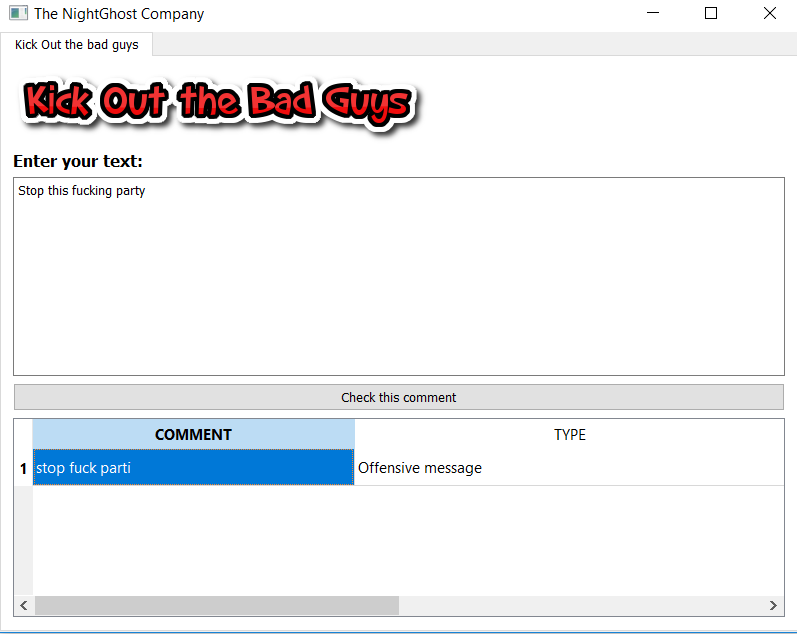

# Kick-out-the-bad-boys - HCL madurAI Hackathon

*Abstract:*
This project is used to find the offensive and hate speeches present in the social network. This project has been achieved using Machine Learning and Natural Language Processing.

*keywords:*
Machine Learning, Natural Language Processing

*(a) Preprocessing the comments:*
The comments present in the social network are in the form of the textual data. Generally for any machine learning model to work we need only the numerical data. In order to get the Numerical Data we are going to preprocess it. The processing is done via, removing the punctuation, by removing the stopwords(is, was, and, etc.,) and finally perform stemming on the stop words. Stemming is the process of converting the words into its root form. For example: loving and loved will be converted to love.

*(b) Bag of words representation*
This is the actual method which will convert the preprocessed text into the numerical data, It will assign a numerical value to all the words present in the text and get the most common words out of it.

*(c) Machine Learning Algorithm*
Finally we are going to apply a Machine Learning algorithm, here we have used LogisticRegression which provides more accuray here compared to other algorithms like DecisionTree and RandomForest.

*(d) Backend:* Scikit-Learn, Pandas, Numpy, NLTK

*(e) FrontEnd:* PyQT

**END RESULT:**

*Note:* See IPython Notebook file for the machine learning model, python file is an example desktop application created from it.
